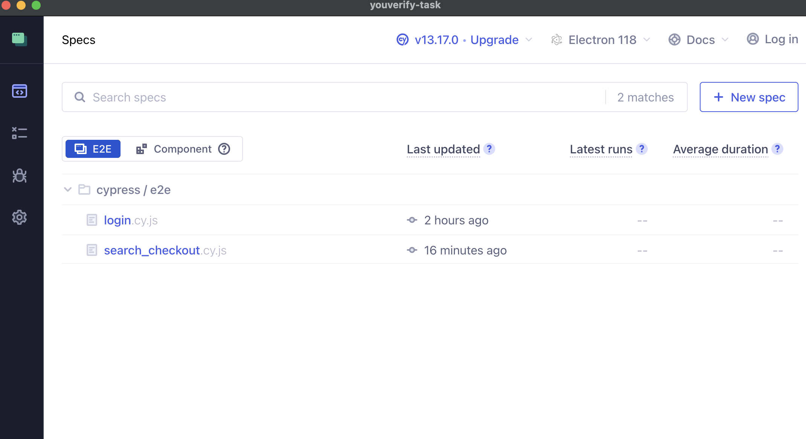
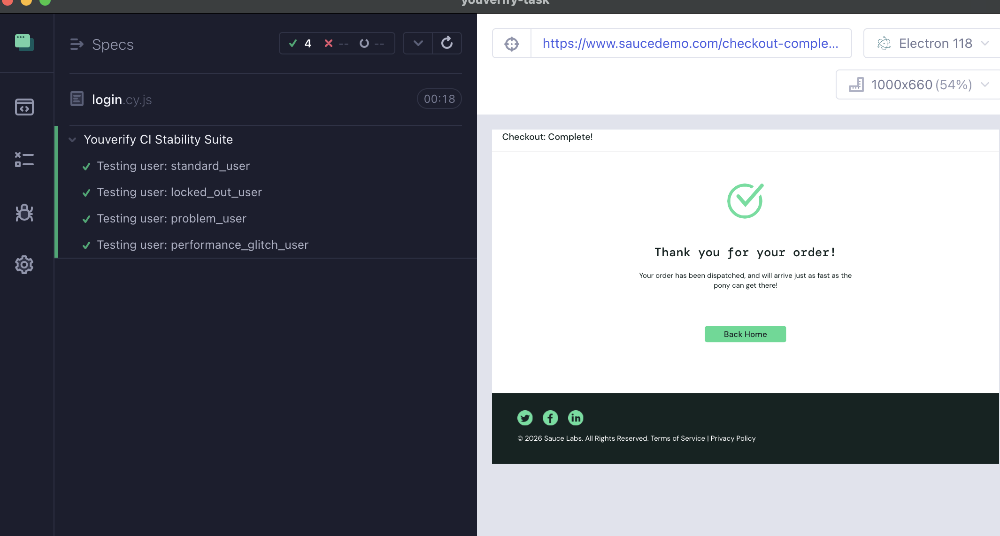
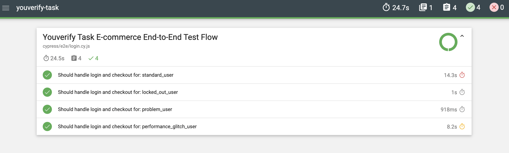
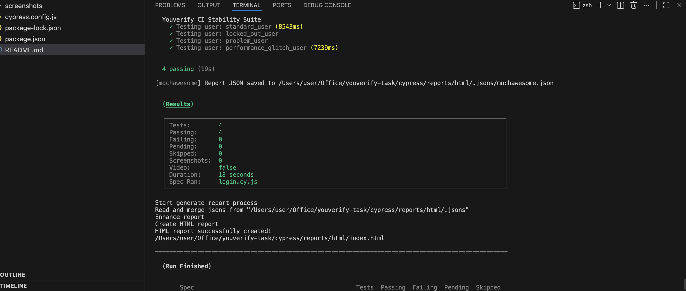
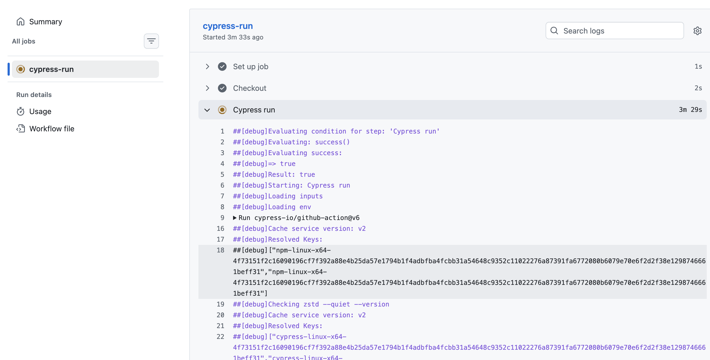
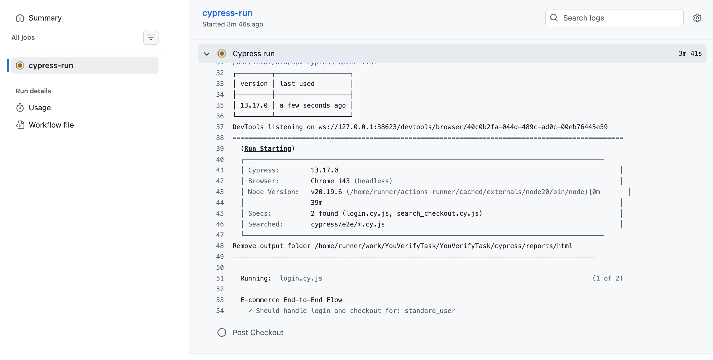
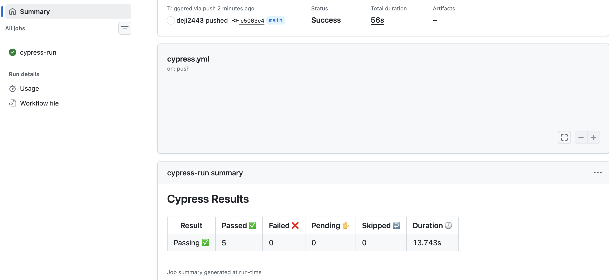

# YouVerifyTask
This automated E2E QA Task is written with **Cypress** and **JavaScript**, following the **Page Object Model (POM)** design pattern.
 
## Task 1
### Steps to run the code
- Clone the repo
- npm install
- npx cypress open                                                            
- Run the specs after opening cypress
- You can run the spec scripts after opening the cypress GUI.
    
    

- You can as well run the E2E test with the followng
    - npx cypress run --spec "cypress/e2e/login.cy.js"
    - npx cypress run --spec "cypress/e2e/search_checkout.cy.js"
- If you ran into error running above E2E test. Run below Script
    - rm -rf cypress/reports && npx cypress run
    - npm install
    - npx cypress run

### Test Report

The HTML report is generated after test execution.

- Allure is also added for clear, detailed and visual report
[Report Link](https://deji2443.github.io/YouVerifyTask/)

- Report will be saved in /cypress/reports/html/
- You can open the index.html file in that directory to also see the report.

### CI/CD Pipeline

Once any update is pushed, the CI/CD pipeline runs automatically.

- Github CI/CD workflow is in .github/workflows/cypress.yml

- Tests pass 100% locally. CI/CD failures are due to environment timeouts on GitHub runners

## Task 2

### How to Access the API Collection
- Navigate to the postman/ folder in this repo.

- Download YouVerify_API_Task_JSONPlaceholder.json.
* **JSON File:** [Download YouVerify_API_Task_JSONPlaceholder.json](./postman/YouVerify_API_Task.json)

- Import the file into your Postman Workspace.

## Task 3: Case Study - Fintech Application Quality Strategy

**Objective:** Diagnostic approach and test strategy for a crashing fintech application.

* **Presentation File:** [Download PPTX](./case-study/Quality_Transformation_Strategy_for_Fintech_App.pptx)
* **Google Slides (Live):** [View Presentation](https://docs.google.com/presentation/d/1SuTaWqWpu5qkH9oMtWyo8PeQh0Ycj3qhDAQg3nDFv6o/edit?usp=sharing)

**Key Highlights:**
- Focus on Error Monitoring (Sentry) and Root Cause Analysis.
- Strategy for cross-device consistency using Cloud Device Farms.
- Implementation of "Shift-Left" testing to prevent production crashes.