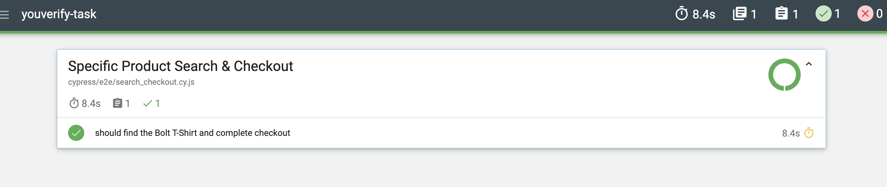

# YouVerifyTask
This automated QA Task is written with Cypress
 
 Steps to run the code
- Clone the repo
- npm install
- npx cypress open                                                            
- Run the specs after opening cypress
- You can run the spec scripts after opening the cypress GUI.
- You can as well run the E2E test with the followng
    - npx cypress run --spec "cypress/e2e/login.cy.js"
    - npx cypress run --spec "cypress/e2e/search_checkout.cy.js"
- Report will be saved in /cypress/reports/html/

- You can open the index.html file in that directory to also see the report.
- Github workflow is in .github/workflows/cypress.yml
- Once any update is been pushed. CI/CD will automaticall run.

